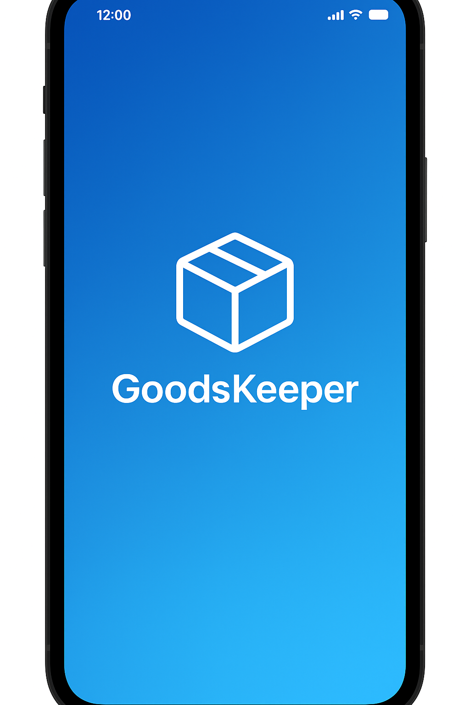
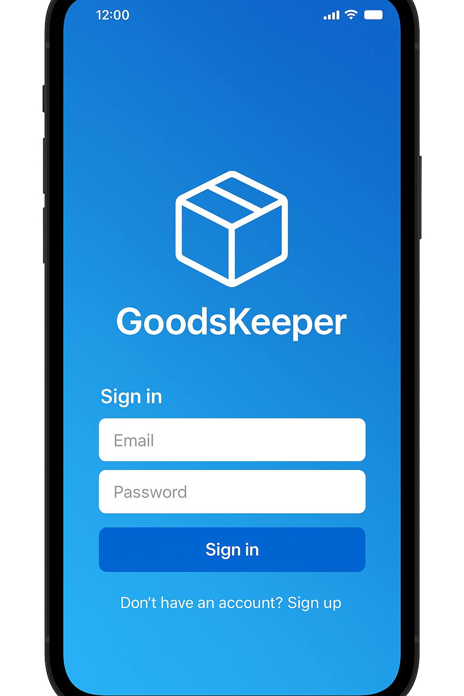
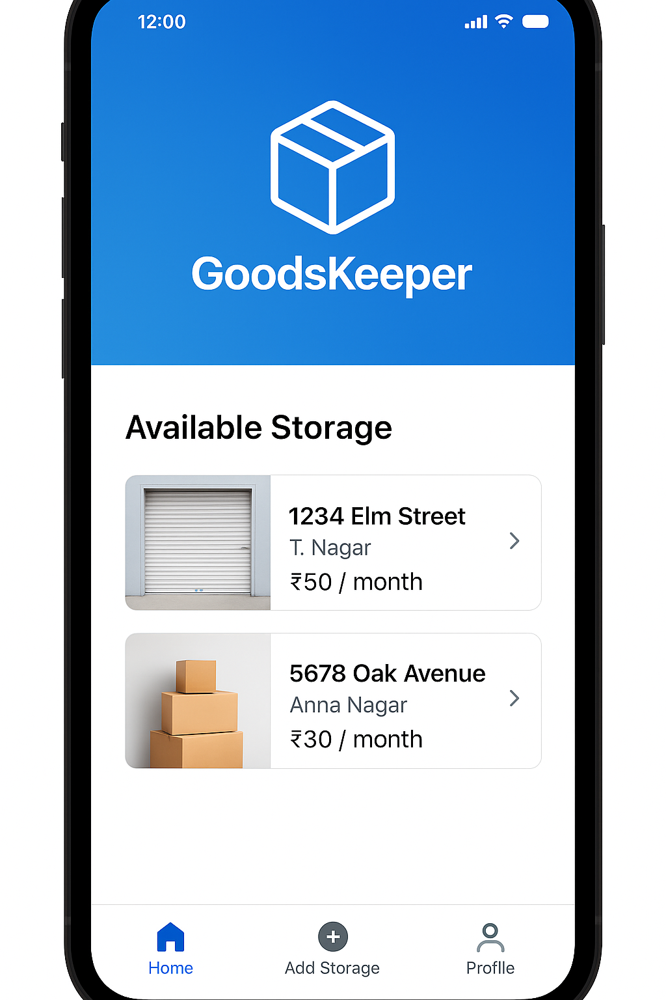
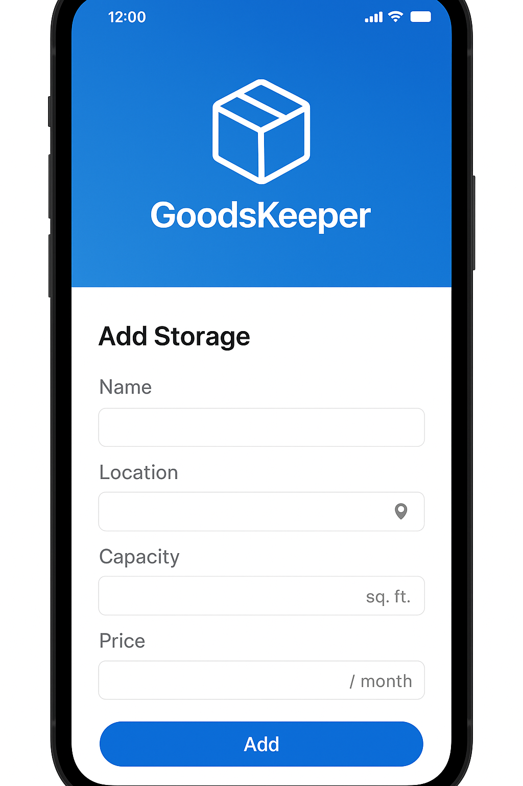

# 📦 GoodsKeeper – Android (Jetpack Compose)

> *Inspired by Kotlin User Group Hackathon 2025*  
> *A simple yet powerful storage-sharing platform built using Kotlin & Firebase.*

---

## 🧠 Overview

**GoodsKeeper** is an Android application built using **Kotlin** and **Jetpack Compose** that connects people who have extra storage space (*Keepers*) with users who need a temporary place to store their goods.  

It’s designed with a **modern, minimal, and scalable architecture** — perfect for real-world use and hackathon demonstration.

---

## 🎯 Key Features

- 🔐 **Firebase Authentication** — Email/Password based secure sign-up and sign-in  
- ☁️ **Firebase Firestore** — Store user and keeper details in real time  
- 🖼️ **Firebase Storage** — Upload and fetch images for storage units  
- 🧭 **Bottom Navigation UI** — Home, Add Storage, Profile sections  
- 💬 **Role Selection** — Choose between Keeper or User on registration  
- 🪄 **Jetpack Compose UI** — Built with Material 3, smooth animations & clean layouts  
- 🧱 **Scalable Architecture** — MVVM-ready and easily extendable for booking or maps integration  

---

## ⚙️ Tech Stack

| Category | Technology |
|-----------|-------------|
| **Language** | Kotlin |
| **UI Toolkit** | Jetpack Compose (Material 3) |
| **Backend** | Firebase Authentication, Firestore, Storage |
| **Architecture** | MVVM + Jetpack Components |
| **IDE** | Android Studio Ladybug / Koala |
| **Build System** | Gradle Kotlin DSL (KTS) |

---

## 🚀 How to Run

1. Clone this repository or download the ZIP.  
2. Open **Android Studio → File → Open → select project folder.**  
3. Replace `app/google-services.json` with your real Firebase config.  
4. In [Firebase Console](https://console.firebase.google.com):
   - Enable **Authentication → Email/Password**
   - Create a **Firestore Database (Native Mode)**
   - Enable **Storage**
5. Click **Sync Project with Gradle Files** and **Run** the app.

---

## 🪪 App Screenshots

| Screen | Preview |
|--------|----------|
| 🏁 **App Entry (Splash)** |  |
| 🔑 **Sign In** |  |
| 🏠 **Home** |  |
| ➕ **Add Storage** |  |

 

---

## 💡 Future Scope
- 📍 Google Maps integration for location-based storage search  
- 💬 In-app chat between user and keeper  
- 📆 Storage booking and payment gateway integration  
- 🔔 Push notifications for booking status updates  

---

## 👩‍💻 Inspiration

Built during the **Kotlin User Group Hackathon 2025**, *GoodsKeeper* represents how Kotlin and Firebase can be used together to solve real-world logistical problems — simple, scalable, and efficient.

---

## 🧩 Notes

- The project includes a **dummy** `google-services.json` for Gradle sync. Replace with your actual Firebase config before deployment.  
- Designed with **Jetpack Compose** for speed, clarity, and modern UI.  
- You can extend this base for **maps, AI-based recommendations**, or **community-based storage sharing**.

---

### 🏁 Made with ❤️ in Kotlin  
> “Connecting people and spaces — one good at a time.”
